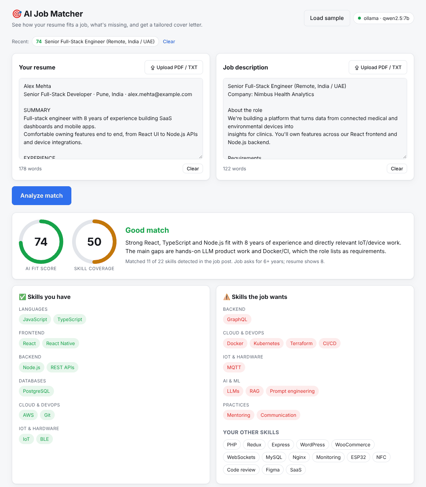
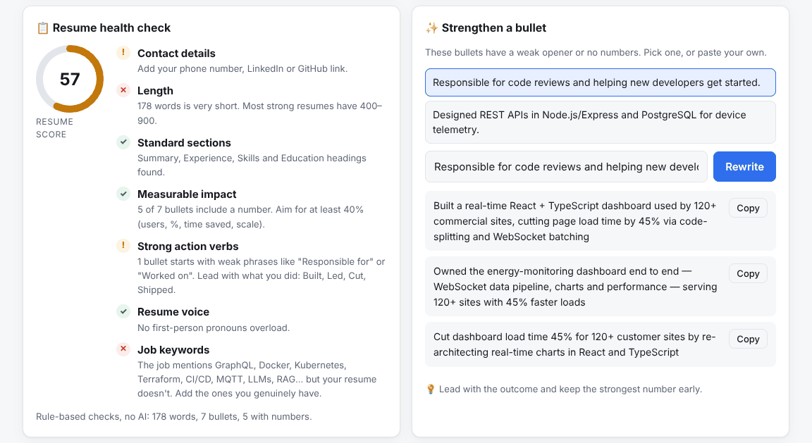
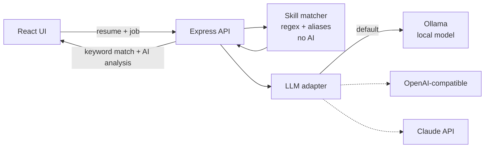

# 🎯 AI Job Matcher

Paste (or upload) your resume and a job description. Get a fit score, the skills you have and the ones you're missing, concrete resume tweaks, likely interview questions, and a tailored cover letter.

**Runs on a local AI model by default** (Ollama) — no API key, no per-request cost, and your resume never leaves your machine. The skill match works with no AI at all.




## Features

- **Rule-based skill match (no AI):** 150+ skills with aliases (`ReactJS` → React, `k8s` → Kubernetes, `C#`, `.NET`, `Node.js`…), grouped by category, plus years-of-experience detection.
- **AI fit analysis:** fit score and verdict, strengths, gaps marked *must-have* / *nice-to-have* with how to close each, resume edits for this specific job, and interview prep questions.
- **Resume health check (no AI):** a score plus seven checks — contact details, length, standard sections, measurable impact, action verbs, first-person voice and job keywords.
- **Strengthen a bullet:** picks your weakest bullets (weak openers, no numbers) and rewrites one three ways. Missing numbers become placeholders like `[X%]` instead of invented facts.
- **Cover letter writer:** streams as it's written; three tones, optional company name and notes ("open to relocating"), and a strict rule to only use facts from your resume.
- **History:** your last 10 analyses are kept in the browser; one click restores any of them.
- **PDF upload** for resumes and job posts (text extraction with `unpdf`).
- Remembers your resume in the browser between visits.
- Works with **Ollama, any OpenAI-compatible API, or Claude** by changing one environment variable.



<sub>Screenshots use the built-in sample resume and job.</sub>

## How it works



The keyword scan runs first and is passed to the model as a hint, so the AI analysis is grounded in what's actually in both documents. If the model is unavailable, the API still returns the keyword match with a clear message.

## Quick start

**Requirements:** Node.js 20+ and [Ollama](https://ollama.com).

```bash
# 1. Get a local model (≈4.7 GB, one time)
ollama pull qwen2.5:7b

# 2. Install and run
npm run setup
npm run dev
```

Open http://localhost:5171 and click **Load sample** to try it.

> Low on RAM? Use a smaller model: `ollama pull qwen2.5:3b` and set `LLM_MODEL=qwen2.5:3b` in `server/.env`.

### Production

```bash
npm run build && npm start      # serves the UI and API on http://localhost:3001
# or
docker compose up -d && docker compose exec ollama ollama pull qwen2.5:7b
```

## Switching AI provider

Copy `server/.env.example` to `server/.env` and set:

| Provider | Settings |
|---|---|
| Ollama (default) | `LLM_PROVIDER=ollama`, `LLM_MODEL=qwen2.5:7b` |
| LM Studio / vLLM / Groq / OpenAI | `LLM_PROVIDER=openai`, `OPENAI_BASE_URL=...`, `OPENAI_API_KEY=...`, `LLM_MODEL=...` |
| Claude | `LLM_PROVIDER=anthropic`, `ANTHROPIC_API_KEY=...` |
| No AI | `LLM_PROVIDER=none` (skill match only) |

All providers go through one small adapter (`server/src/llm.ts`) that uses plain `fetch` — no vendor SDKs.

## API

| Method | Path | Body | Notes |
|---|---|---|---|
| `GET` | `/api/health` | – | Which model is active and whether it's reachable |
| `POST` | `/api/extract` | `multipart file` | PDF/TXT/MD → text |
| `POST` | `/api/analyze` | `{ resume, job, useAi? }` | `{ keywords, ats, ai, aiError }` |
| `POST` | `/api/cover-letter` | `{ resume, job, tone, company?, notes? }` | NDJSON stream of `token` events, then `done` |
| `POST` | `/api/rewrite-bullet` | `{ bullet, job? }` | `{ rewrites[3], tip }` |

AI routes are rate limited (`AI_RATE_LIMIT`, default 30/min per IP). If no model is available they return `503` with `aiUnavailable: true`, so the UI can fall back gracefully.

## Project structure

```
server/src
  app.ts        routes            index.ts   starts the server
  skills.ts     skill catalogue + deterministic matcher
  ats.ts        rule-based resume checks
  analyze.ts    AI analysis, cover letter and bullet prompts, output validation
  stream.ts     NDJSON token streaming to the browser
  extract.ts    PDF/text extraction
  llm.ts        provider-agnostic LLM client (chat, streaming, retries)
  *.test.ts     unit + end-to-end API tests (fake model server)
client/src
  App.tsx, components/   React UI (Vite)
```

## Scripts

`npm run dev` · `npm run build` · `npm start` · `npm test` · `npm run typecheck`

## License

MIT © Faisal
